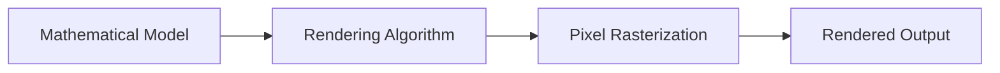

# Computer Graphics Lab — Algorithms & Rendering Fundamentals

**Computer Graphics Lab** is a collection of educational and practical projects focused on **core computer graphics algorithms**, rendering techniques, and mathematical foundations of visual computing.

The repository demonstrates hands-on implementation of classic graphics topics, ranging from primitive drawing to transformations and rasterization logic.

This project emphasizes **algorithmic thinking, math-driven rendering, and low-level graphics concepts**, rather than using high-level engines or frameworks.

---

## What This Repository Is About

This repository is a **computer graphics fundamentals showcase**.

It demonstrates how to:
- implement classic rendering algorithms from scratch
- work with coordinate systems and transformations
- understand rasterization and pixel-level operations
- apply mathematical models to visual output
- structure multiple graphics experiments in a single repository

The same foundational knowledge is applicable to:
- game engines
- rendering pipelines
- visualization systems
- GPU programming fundamentals

---

## Repository Structure

```
computer-graphics/
├── Graf1-master/    Basic drawing primitives
├── Graf2-master/    Line and shape algorithms
├── Graf3-master/    Transformations & projections
├── Graf4-master/    Rasterization techniques
├── Graf5-master/    Advanced rendering experiments
└── README.md
```

Each subproject focuses on a **specific graphics topic** and builds upon previous concepts.

---

## Key Topics Covered

- Coordinate systems and transformations
- Line drawing algorithms
- Shape rasterization
- Pixel-level rendering logic
- Mathematical foundations of graphics
- Incremental complexity across projects

---

## High-Level Conceptual Architecture



**Core idea:** visual output is a direct result of mathematical transformations and algorithms.

---

## Technology Stack

- **Programming Language:** C++ / C / Python (depending on subproject)
- **Rendering Approach:** Software-based rendering
- **Math Foundations:** Linear algebra, geometry
- **Tooling:** IDE-based builds, local execution

*(Exact technologies vary per subproject)*

---

## What This Project Demonstrates

- Understanding of computer graphics fundamentals
- Ability to implement algorithms without high-level engines
- Strong mathematical and algorithmic thinking
- Step-by-step construction of rendering logic
- Educational clarity and structure

---

## How to Use

Each `Graf*` directory is an independent project:
1. Open the folder
2. Follow project-specific instructions (if any)
3. Build and run locally using the provided source code

---

## Design Principles

- Algorithms over abstractions
- Math-driven rendering
- Explicit control over pixels
- Progressive complexity

---

## Final Notes

Computer Graphics Lab is intentionally focused on **foundational knowledge**.

It serves as a strong base for further work in:
- GPU programming
- shader development
- game engine architecture
- real-time rendering systems
